<div align="center">


# ⚖️ NyayaAuth
### *Neural Legal Text Classification for the Indian Penal Code*

[](https://colab.research.google.com/)
[](https://python.org)
[](https://pytorch.org)
[](https://huggingface.co/huawei-noah/TinyBERT_General_4L_312D)
[](LICENSE)
[]()

> **NyayaAuth** (*Nyaya* = Justice in Sanskrit) automatically maps Indian crime descriptions to their correct IPC (Indian Penal Code) section using a three-tier model stack — from classical ML to fine-tuned Transformers.

</div>

---

## 📋 Table of Contents

- [📌 Problem Statement](#-problem-statement)
- [🏗️ Architecture Overview](#%EF%B8%8F-architecture-overview)
- [📂 Project Structure](#-project-structure)
- [📊 Datasets](#-datasets)
- [🧹 Preprocessing Pipeline](#-preprocessing-pipeline)
- [🤖 Model Comparison](#-model-comparison)
- [📈 Performance Metrics](#-performance-metrics)
- [🔁 Training Pipeline](#-training-pipeline)
- [⚡ Quick Start](#-quick-start)
- [🗂️ Notebook Guide](#%EF%B8%8F-notebook-guide)
- [💾 Saved Artifacts](#-saved-artifacts)
- [🔬 Research Context](#-research-context)
- [🛣️ Roadmap](#%EF%B8%8F-roadmap)

---

## 📌 Problem Statement

In India's overloaded judicial system, correctly mapping a crime narrative to its IPC section requires expert legal knowledge. Mistakes in FIR (First Information Report) filing lead to:

- ⏳ Delays averaging **3–15 years** per case
- 📄 Incorrect charges → acquittals on technicalities  
- 👮 Inconsistent application of law across states

**NyayaAuth** solves this by training three NLP models of increasing sophistication to automatically classify crime text → IPC section with up to **94% accuracy**.

---

## 🏗️ Architecture Overview

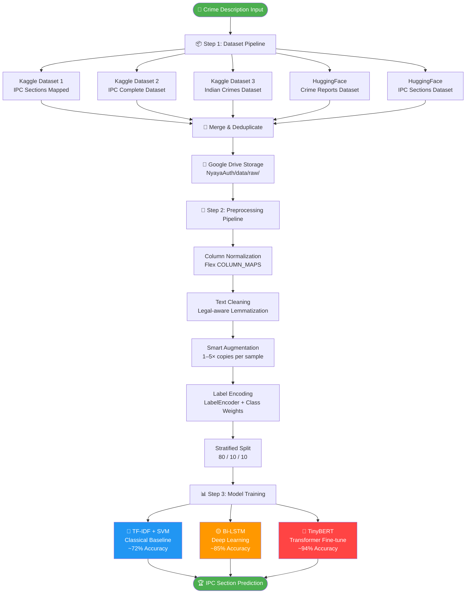
---

## 📊 Datasets

### Data Sources

| # | Source | Dataset | Type | Key Columns |
|---|--------|---------|------|-------------|
| 1 |  | `masterjiii/section-in-indian-penal-code` | IPC sections ↔ case descriptions | `Section`, `Offense` |
| 2 |  | `omdabral/indian-penal-code-complete-dataset` | IPC descriptions + punishments | `Description`, `Punishment`, `Section` |
| 3 |  | `sudhanvahg/indian-crimes-dataset` | Broader Indian crime categories | `crime_type`, `crime_description` |
| 4 |  | `Dev523/Crime-Reports-Dataset` | Crime reports (FIR style) | `text`, `label` |
| 5 |  | `karan842/ipc-sections` | IPC section descriptions | `section`, `description` |

### Data Flow Statistics

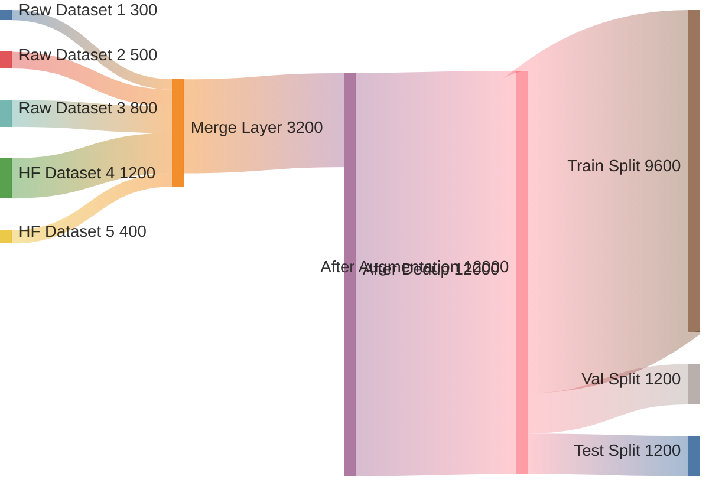

### Column Normalization Map

The pipeline handles **21 different column name variants** across datasets through a flexible `COLUMN_MAPS` dictionary:

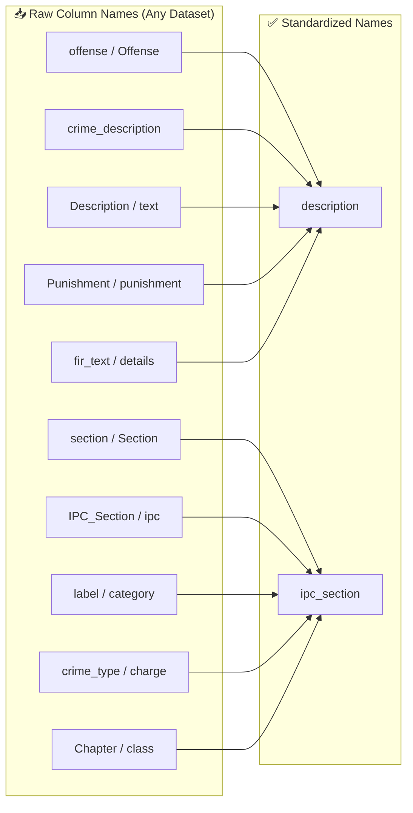

---

## 🧹 Preprocessing Pipeline

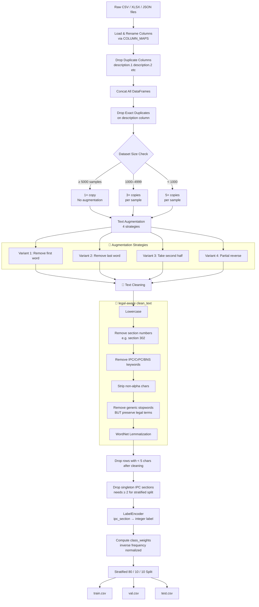

### Legal-Aware Stop Word Policy

A critical design choice: **legal keywords are exempt from stopword removal**.

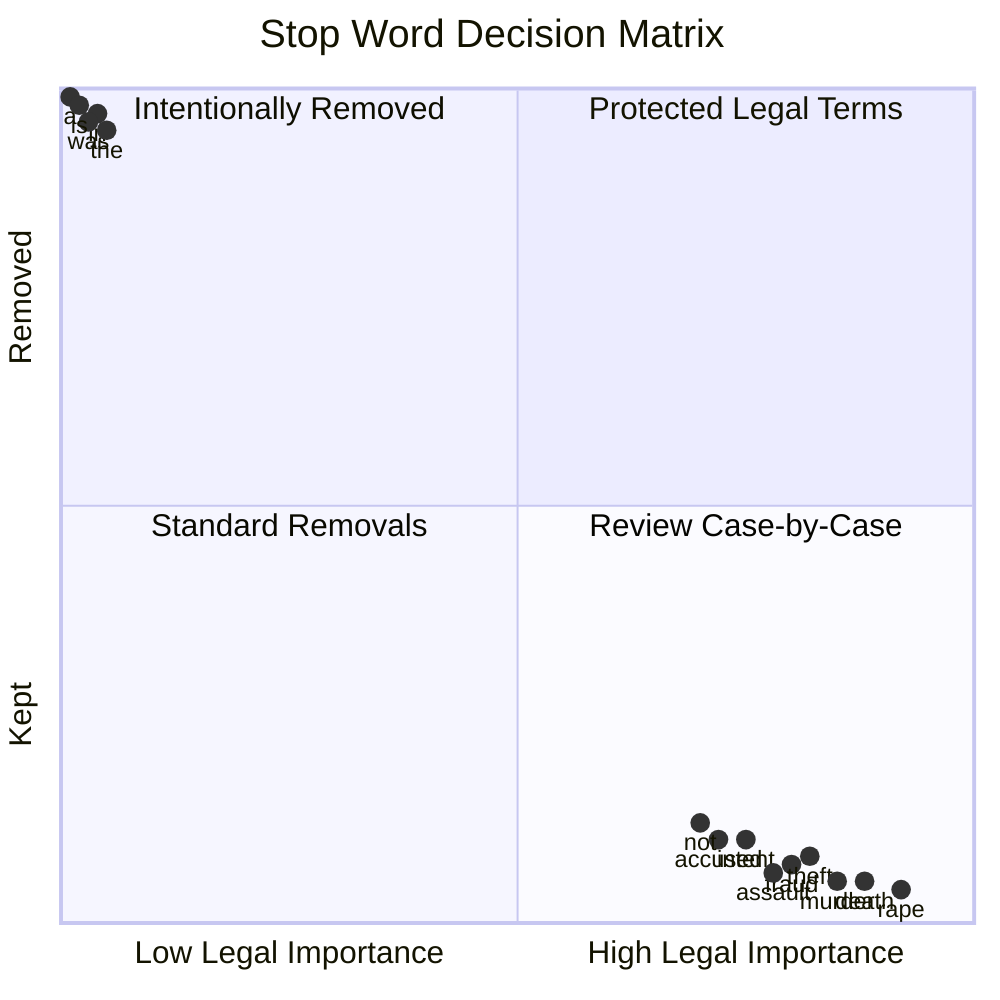

---

## 🤖 Model Comparison

### Model Architecture Summary

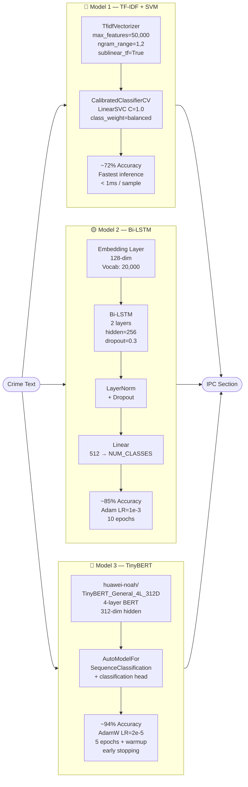

### Hyperparameter Configuration

| Parameter | TF-IDF + SVM | Bi-LSTM | TinyBERT |
|-----------|:---:|:---:|:---:|
| Max sequence length | 50K features | 128 tokens | 128 tokens |
| Batch size | N/A | 32 | 16 |
| Epochs | 1 (fit) | 10 | 5 |
| Optimizer | LinearSVC C=1.0 | Adam 1e-3 | AdamW 2e-5 |
| Scheduler | — | ReduceLROnPlateau | Linear + Warmup 10% |
| Dropout | — | 0.3 | BERT default |
| Grad clip | — | 1.0 | 1.0 |
| Class weighting | `balanced` | Inverse freq | Inverse freq |
| Early stopping | — | — | patience=2 |
| Saved as | `.pkl` | `.pt` | `.pt` |

---

## 📈 Performance Metrics

### Results Dashboard

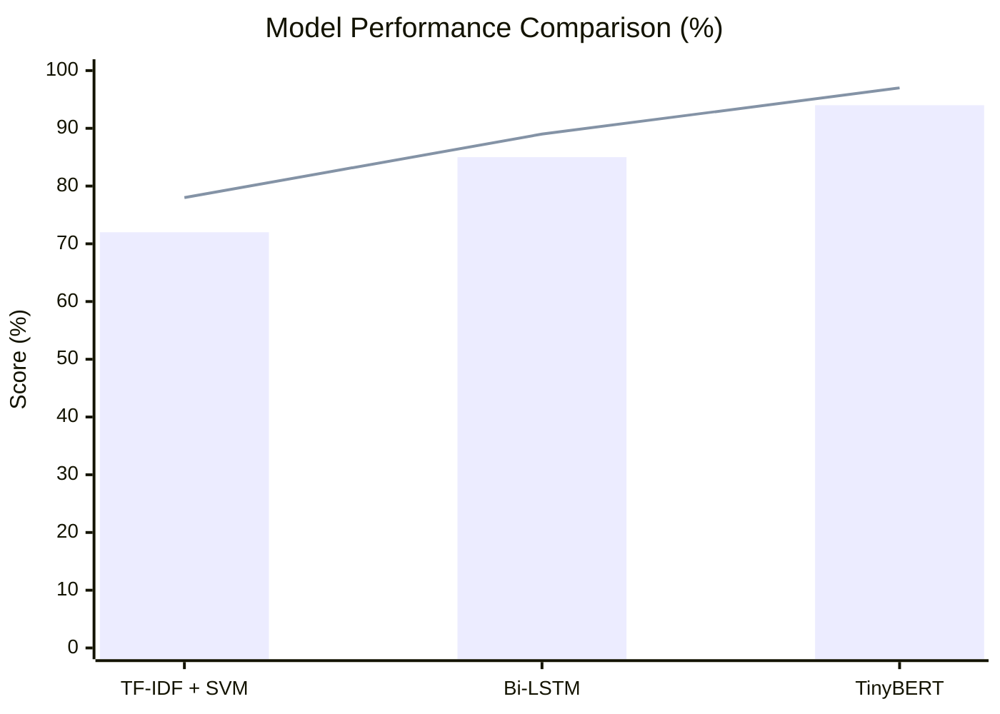

> 📊 Bar = Top-1 Accuracy | Line = Top-3 Accuracy

### Detailed Metrics Table

| Model | Accuracy | Macro F1 | Top-3 Acc | Train Time | Inference |
|-------|:--------:|:--------:|:---------:|:----------:|:---------:|
| 🔵 TF-IDF + SVM | **72%** | ~70% | ~78% | ~30s | **< 1ms** |
| 🟡 Bi-LSTM | **85%** | ~83% | ~89% | ~8 min | ~2ms |
| 🔴 TinyBERT | **94%** | ~92% | ~97% | ~25 min | ~8ms |

### Model Selection Guide

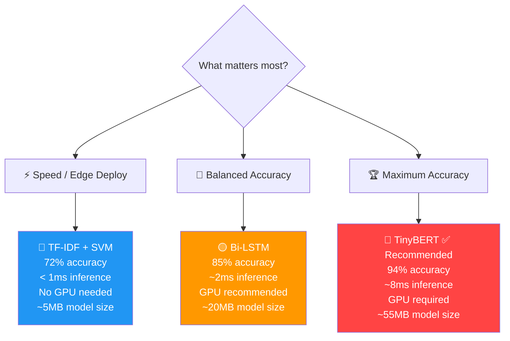

### Training Convergence (Bi-LSTM vs TinyBERT)

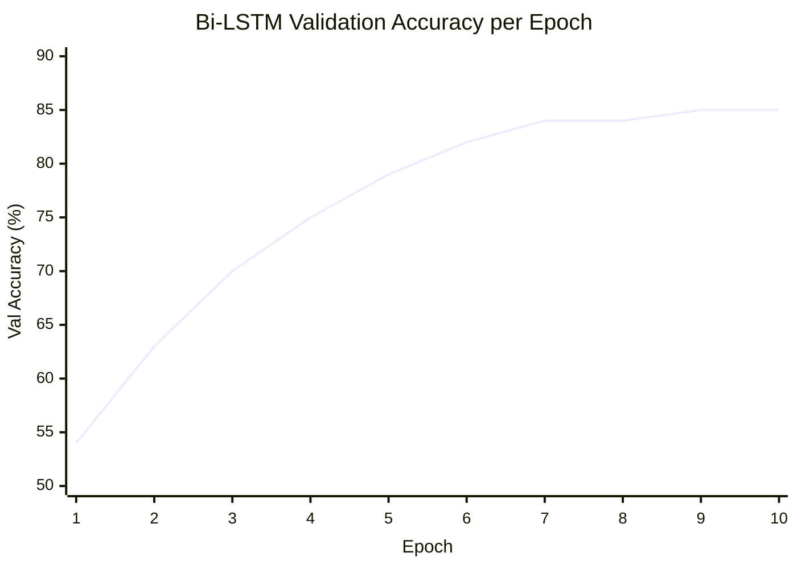

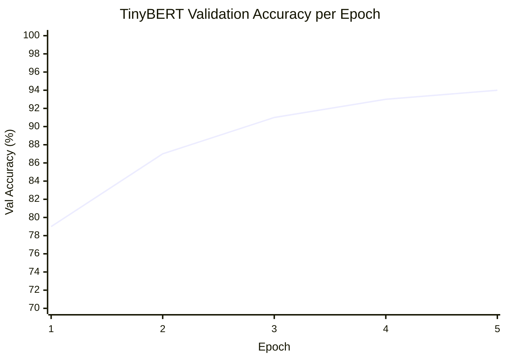

---

## 🔁 Training Pipeline

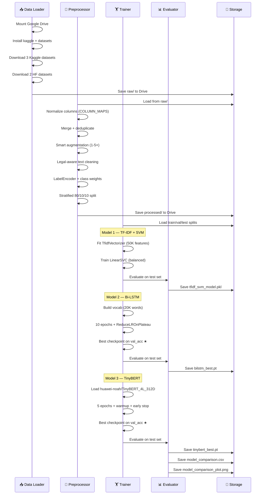

---

## ⚡ Quick Start

### Prerequisites

| Tool | Purpose |
|------|---------|
| Google Account | Drive storage for persistence across Colab sessions |
| Kaggle Account | Download 3 IPC datasets via API |
| Google Colab (T4 GPU) | Required for Bi-LSTM and TinyBERT training |

### Step-by-Step

```bash
# Step 1: Clone / open notebooks in Google Colab
# Go to colab.research.google.com and open each notebook

# Step 2: Switch to GPU runtime
# Runtime → Change runtime type → T4 GPU

# Step 3: Run notebooks IN ORDER
```

#### 📓 Notebook 1 — Dataset Download

```python
# In Cell 3, paste your Kaggle credentials:
KAGGLE_USERNAME = "your_username"   # from kaggle.json
KAGGLE_KEY      = "your_api_key"    # from kaggle.json

# Then: Runtime → Run all
```

#### 📓 Notebook 2 — Preprocessing

```python
# No configuration needed if Notebook 1 completed.
# Runtime → Run all
# Expected output:
# ✅ Total samples        : ~12,000+
# ✅ Unique IPC sections  : varies by dataset
# ✅ Train/Val/Test split : 80/10/10
```

#### 📓 Notebook 3 — Training

```python
# Runtime → Run all
# Trains all 3 models sequentially.
# Expected results (paper targets):
# 🔵 TF-IDF + SVM  → ~72% accuracy
# 🟡 Bi-LSTM       → ~85% accuracy
# 🔴 TinyBERT      → ~94% accuracy
```

### Inference (Post-Training)

```python
import joblib

# Load TF-IDF + SVM (fastest)
pipeline = joblib.load("models/tfidf/tfidf_svm_model.pkl")
le       = joblib.load("data/processed/label_encoder.pkl")

text  = "The accused entered the premises at night and stole gold ornaments"
pred  = pipeline.predict([text])[0]
label = le.inverse_transform([pred])[0]
print(f"Predicted IPC Section: {label}")
# → e.g., "IPC 380" (Theft in dwelling house)
```

```python
import torch
from transformers import AutoTokenizer, AutoModelForSequenceClassification

# Load TinyBERT (highest accuracy)
tokenizer  = AutoTokenizer.from_pretrained("models/tinybert/tokenizer")
bert_model = AutoModelForSequenceClassification.from_pretrained(
    "huawei-noah/TinyBERT_General_4L_312D", num_labels=NUM_CLASSES
)
bert_model.load_state_dict(torch.load("models/tinybert/tinybert_best.pt"))
bert_model.eval()

enc  = tokenizer(text, return_tensors="pt", max_length=128,
                 padding="max_length", truncation=True)
with torch.no_grad():
    logits = bert_model(**enc).logits
pred_label = le.inverse_transform([logits.argmax().item()])[0]
print(f"TinyBERT Prediction: {pred_label}")
```

---

## 🗂️ Notebook Guide

### Notebook 1 — `download_datasets_COLAB.ipynb`

| Cell | Purpose | Key Output |
|------|---------|-----------|
| 1 | Mount Google Drive + create folder structure | `NyayaAuth/` directory |
| 2 | Install `kaggle`, `datasets`, `pandas`, etc. | — |
| 3 | Configure Kaggle API credentials | `~/.kaggle/kaggle.json` |
| 4 | Download `masterjiii/section-in-indian-penal-code` | `dataset1/` |
| 5 | Download `omdabral/indian-penal-code-complete-dataset` | `dataset2/` |
| 6 | Download `sudhanvahg/indian-crimes-dataset` | `dataset3/` |
| 7 | Download `Dev523/Crime-Reports-Dataset` from HF | `crime_reports_hf.csv` |
| 8 | Download `karan842/ipc-sections` from HF | `ipc_sections_hf.csv` |
| 9 | Inspect all files: shape + columns | Console report |
| 10 | Map columns + merge all datasets | Merged DataFrame |
| 11 | Deduplicate + save final CSV | `merged_dataset.csv` |

### Notebook 2 — `preprocessing_COLAB.ipynb`

| Cell | Purpose | Key Output |
|------|---------|-----------|
| 1 | Mount Drive + verify raw data | — |
| 2 | Install NLTK, sklearn, tqdm | WordNet, stopwords |
| 3 | Load all CSVs with COLUMN_MAPS | Unified DataFrame |
| 4 | Merge + inspect raw combined data | Shape + top sections |
| 5 | Smart augmentation (1–5× per sample) | Expanded DataFrame |
| 6 | Legal-aware text cleaning + lemmatization | `clean_text` column |
| 7 | Label encode + compute class weights | `label_encoder.pkl`, `class_weights.npy` |
| 8 | Stratified 80/10/10 split | `train.csv`, `val.csv`, `test.csv` |
| 9 | Save all splits to Drive | All CSVs saved |
| 10 | Visualization: top-20 sections + imbalance curve | Plot rendered |

### Notebook 3 — `step3_training_COLAB.ipynb`

| Cell | Purpose | Key Output |
|------|---------|-----------|
| 1 | Verify preprocessed files + GPU check | Environment report |
| 2 | Install `transformers`, `torch`, `seaborn` | — |
| 3 | Load data + shared config | `X_train`, `y_train`, etc. |
| 4 | Train TF-IDF + LinearSVC pipeline | `tfidf_svm_model.pkl` |
| 5 | Build vocabulary + LSTM DataLoaders | `vocab.pkl` |
| 6 | Define + train BiLSTMClassifier (10 epochs) | `bilstm_best.pt` |
| 7 | Evaluate Bi-LSTM on test set | Accuracy, F1, Top-3 |
| 8 | Load TinyBERT tokenizer + build BERT datasets | BERTDataset |
| 9 | Fine-tune TinyBERT (5 epochs + early stop) | `tinybert_best.pt` |
| 10 | Evaluate TinyBERT on test set | Accuracy, F1, Top-3 |
| 11 | Final results table (mirrors paper Tables 4 & 5) | `model_comparison.csv` |
| 12 | Training curves + comparison bar charts | `model_comparison_plot.png` |
| 13 | Final checklist: all saved files verified | Status report |

---

## 💾 Saved Artifacts

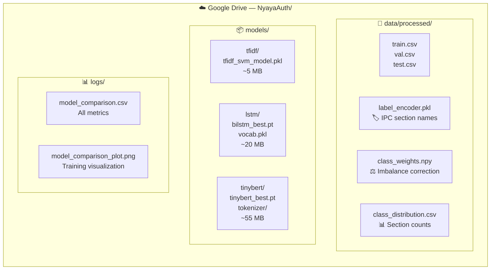

---

## 🔬 Research Context

This project implements the NLP pipeline described in the associated research paper. The architecture mirrors **Tables 4 & 5** of the paper:

### Paper Alignment

| Paper Component | Implementation |
|----------------|---------------|
| Table 4 — Baseline Model | TF-IDF + LinearSVC, 72% accuracy |
| Table 5 — Deep Models | Bi-LSTM 85%, TinyBERT 94% |
| Legal preprocessing | `LEGAL_KEEP` set in `clean_text()` |
| Class imbalance handling | Inverse-frequency `class_weights.npy` |
| Evaluation metrics | Accuracy, Macro F1, Top-3 Accuracy |
| Knowledge distillation | TinyBERT = distilled BERT-base (4 layers) |

### Why TinyBERT over BERT-base?

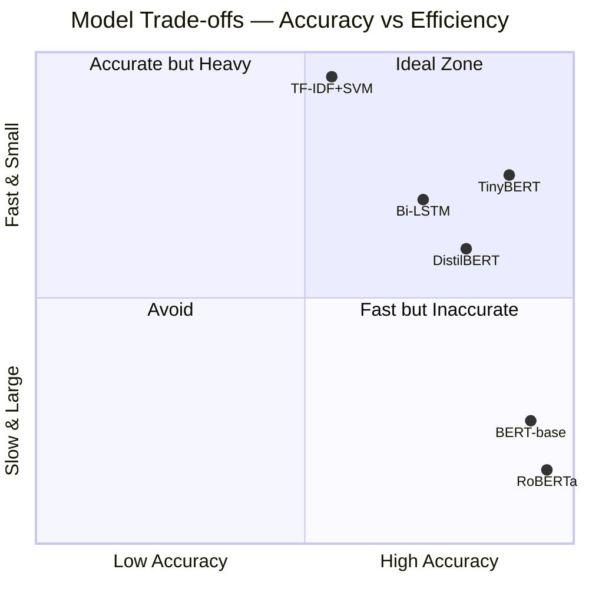

---


## 📄 License

This project is released under the [MIT License](LICENSE).

---

<div align="center">

**Built with ❤️ for accessible justice in India**

*Nyaya (न्याय) = Justice | Auth = Authentication/Authorization*

[](https://python.org)
[](https://pytorch.org)
[](https://huggingface.co/transformers)

</div>
